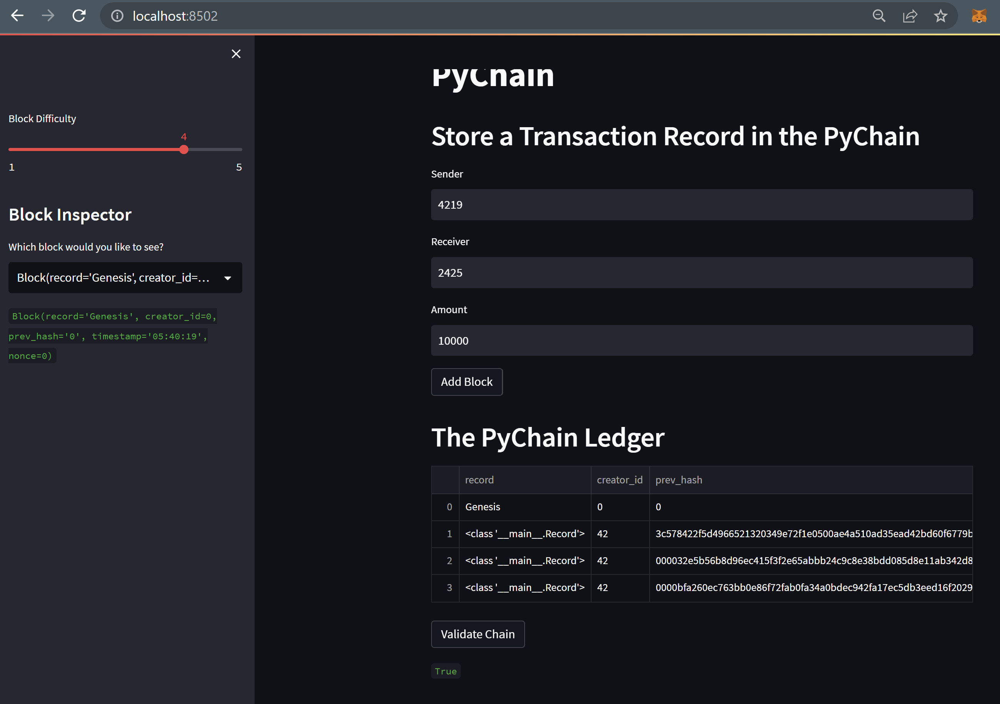

# Blockchain-based Ledger

## Purpose: 
The task is to build a blockchain-based ledger system, complete with a user-friendly web interface. This ledger should allow partner banks to conduct financial transactions (that is, to transfer money between senders and receivers) and to verify the integrity of the data in the ledger.

### The steps for this Challenge are divided into the following sections:

- Create a Record Data Class

- Modify the Existing Block Data Class to Store Record Data

- Add Relevant User Inputs to the Streamlit Interface

- Test the PyChain Ledger by Storing Records

